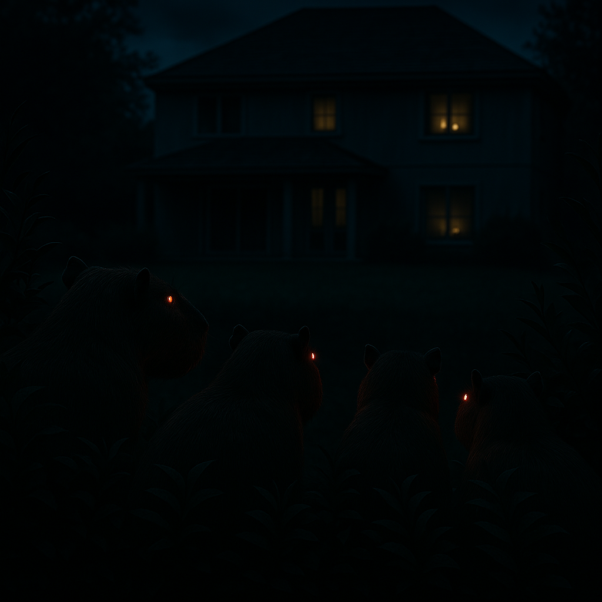
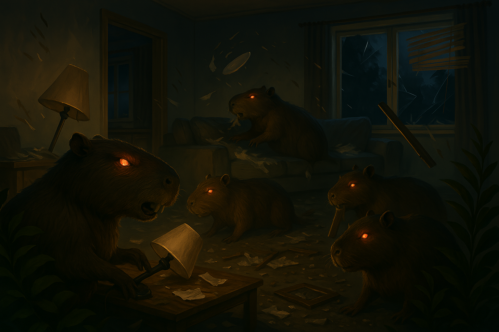
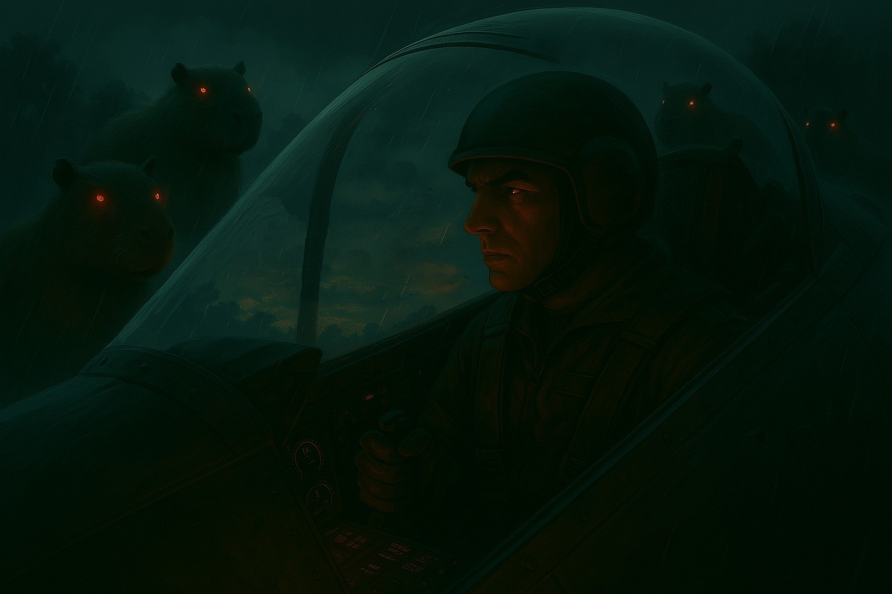

 # 🎮 Carpinchos Invasores - Pygame 


## Descripción

**Carpinchos invasores** es un juego de naves donde tendras que sobrevivir a la sorpresiva invasión de lo carpinchos.

---

## 📚 Manual

### Historia
- En una noche tranquila en **Nordelta**


- **Los Carpinchos** se asoman lentamente con intenciones desconocidas 



- Cuando de pronto todas las casas son emboscadas por *los seres más tranquilos del planeta* (**Los carpinchos**)



- Podrás detener esta **Gran invasión**?



### 🚀 Cómo jugar
 
- Use las **flechas (⬅➡⬆⬇)** para moverte

- Presiona **Espacio** para disparar  

- Eliminá enemigos y esquivá sus ataques.

- **Sobreviví el mayor tiempo posible!**

---

## ✨ Características

- **Interfaz de menú :** Jugar, Ranking y Salir 

- **Introducción :** Imagen estática con texto que introduce la historia

- **Enemigos :** Carpinchos que caen del cielo

- **Jugador :** Nave que dispara

- **Efectos :** Efectos de sonido y parpadeo de la nave al ser golpeada

- **Sistema de puntuación :** Un ranking que toma al top 5 de puntajes más alto

---

## Estructura del proyecto
```
fly-cats-game/
├── assets/                         # Recursos multimedia
│   ├── fonts/                      # Fuentes del juego
│   ├── images/                     # Imagenes del juego
│   │   ├── backgrounds/            # Imagenes de fondo
│   │   ├── botones/                # Imagenes de botones
│   │   ├── models/                 # Imagenes de enemigos, naves y vida
│   │   └── readme/                 # Imagenes del README
│   └── sounds/                     # Música y efectos de sonidos
├── consts/                         # Constantes
│   ├── __init__.py                 # Inicializador del paquete
│   └── constantes.py               # Módulo de constantes
├── game/                           # Funciones del juego
│   ├── __init__.py                 # Inicializador del paquete
│   ├── colisiones.py               # Detección de colisiones
│   ├── estados.py                  # Estados del juego
│   ├── gameloop.py                 # Loop principal del juego
│   ├── inicializacion.py           # Inicia una ventana de pygame     
│   ├── menu.py                     # Funciones de menu
│   ├── musica.py                   # Inicia la música del juego
│   ├── pantallas.py                # Dibuja en pantalla los estados
│   ├── ranking_unificado.py        # Funciones del ranking y el puntaje
│   ├── recursos.py                 # Carga los recursos del juego
│   └── vidas.py                    # Dibuja las vidas
├── playerdata/                     # Datos de nave, enemigos y balas
│   ├── __init__.py                 # Inicializador de paquetes
│   ├── balas.py                    # Datos de balas
│   ├── enemigos.py                 # Datos de enemigos
│   └── nave.py                     # Datos de nave
├── intro.py                        # Funciones de la intro
├── principal.py                    # Se ejecuta el juego
├── puntajes.txt                    # Texto de los puntajes
└── README.md                       # README
```
---

## Instalación

### Requisitos:

Para ejecutar este juego necesitas tener instalados:

- Python 3.8 o superior

- Pygame 2.0 o superior

### Paso a paso

1. Clona el repositorio:
```bash
git clone https://github.com/plazagustavo/Carpinchos-Invasores.git
```

2. Instalación de dependencias:
```
pip install pygame  
```
3. Ejecuta el juego:
```bash
python principal.py
```

## Créditos

Equipo de desarrollo **Super Capy Bros**

### Integrantes:

- **Alejandro Ken Morita**

[](https://github.com/alekgith)

- **Gustavo Plaza**

[](https://github.com/plazagustavo)

- **Walter Moran**

[](https://github.com/WalterMoran24)

## 📄 Licencia
Este proyecto es de uso libre para fines educativos o personales. Si lo usás o modificás, ¡agradecemos que des créditos!